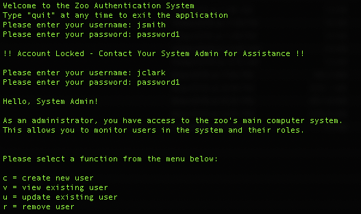
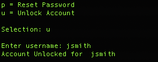
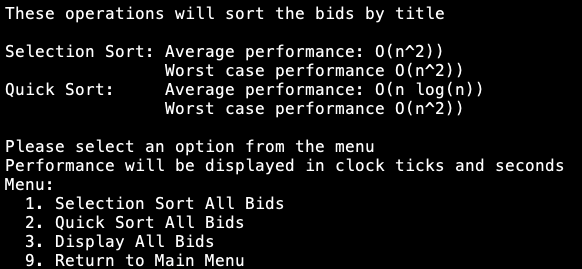

# Welcome to My ePortfolio

I have created this portfolio to showcase some of my best projects that I have created as I work to complete my Computer Science degree at Southern New Hampshire University. These projects will highlight my skills in the following areas: 
- Software Design and Engineering
- Data Structures and Algorithms
- Databases

Along with the projects I have also included a video of me doing a Code Review. The Code Review was recorded before I began my work on these projects and explained the changes that I wanted to make.  

## Code Review
Check out the link below to view my code review. The Code Review is a great place to start as it will help you see how I evaluate my own work, how I plan and implement changes and upgrades, and my thought process as I approach problems. It will also give you a look at the code that I used as a baseline for these projects to you can see how much they have improved since they were originally created. 

[Code Review (YouTube)](https://youtu.be/yofjyBlPDAc)

## Project One: Zoo Authentication System
#### Skills Highlighted
- Software Design and Engineering
- Database Design and Integration 

#### Application Overview
This application is an updated version of an application I made in the fall of 2017. This was part of a course focused on Software Design Best Practices using Java. We were asked to build an authentication system for an imaginary Zoo. To give you a brief overview of the project, the previous version of the application had some users saved in a Java class with their passwords and roles saved in the class as attributes of the user object. You could then use the system to "login" as a user and depending on your role you would see a different welcome message. An in depth version of the old code can be seen in my code review but that is the basic idea of the system. The new version of the system has been rewritten in Python and now includes a MySQL database consisiting of a 'name' and 'user' table. Python and SQL are two of the most common languages used by developers and I feel that this application is a solid piece of work that highlights my skills. 

#### Design Highlights
I wanted to build an application that would be more realisitc and mimic a real authentication system. Logging into a system is something that almost everyone should be familiar with so I tired to add features that a user would understand. I also wanted to add persistant storage and the ability to manipulate users. In the previous version you had no way to add new users, change a password, or do anything else besides login. In order to make this application more realistic I connected the authentication system to a database. This gives us the ability to create new users, change a users password, lockout a user after 3 failed bad password attempts, and unlock a user account. 

Here is an example of a method found in the project. Here we see the method for creating a new user and adding them to the SQL database
```python
def createUser():
    print("Enter the following information - all fields are required")
    firstName = str(input("Enter New User's First Name: "))
    lastName = str(input("Enter New User's Last Name: "))
    username = createUsername(firstName, lastName)
    print("Username: " + username)
    password = createPassword()
    role = str(input("Enter New User's Role (Admin/User): "))
    sql = "INSERT INTO name(first_name, last_name) values(%s, %s);"
    val = (firstName, lastName)
    cursor.execute(sql, val)
    mydb.commit()
    sql = "INSERT INTO users(username, password, role, lockout_status, namekey)\
        values(%s, %s, %s, %s, %s);"
    val = (username, password, role, "F", cursor.lastrowid)
    cursor.execute(sql, val)
    mydb.commit()
    print("User successfuly created")
```

#### Running the Application 
For this application we have two roles, a user and an admin. When you start the application you are presented with a welcome message and a prompt to enter your username and password. When you login as an admin you have the ability to create a new user, change a users password, view a single user or all users, unlock a user, or remove a user. When you login as a user you have the ability to change your password or view your own user account. 

Check out these clips from the application to see how easy this system is to use.
 

#### Why I Love This Project
I enjoyed creating the application to include the MySQL database. Including a database in this application presented some new challenges and allowed me to include some new features as well. I love the flexibility of Python and how easy it is to implement things like hashed passwords, MySQL connections, and menus for users and admin. I also think that Python is a great language for sharing projects because it is so easy to read and understand. Anyone else with a basic understanding of Python and software development can check out this project and understand the logic and design of the application. 

#### Check It Out! 
**[The full application can be found here.](https://github.com/csears1229/Zoo-System)** The MySQL database has been created on a cloud server so the application is ready to run once you download the files. I have also included some SQL scripts that can be used to create the database on your local machine and insert the test data to run the application on yourself. 

## Project Two: Municipal Government Bid System
### Skills Highlighted
- Data Structures and Algorithms
- Software Design and Engineering

### Application Overview
This application was first created early 2018 for my class on data structures and alogorithms using C++. At this time we were introduced to different data structures and asked to create algorithms to implement sorting, inserting, and searching functionality for the different structures. We were also give a CSV file containing bid information for about 180 items that had sold in a municipal government auction. We used our algorithms to manipulate the 180 bids into different structures and time the differnt operations to measure efficiency. 

### Design Highlights 
For this application I really wanted to do something much larger to really show how different desing patterns. I feel that creating effective algorithms and being able to select appropriate data structures set you ahead as a developer. Everyone wants to see programs that are fast, effective, and easy to use or maintain. To accomplish this I used a list of almost 18,000 bids and created algorithms to sort, search, and insert data into a few popular data structures. This not only demonstrates my skill as a developer, but also contains good modular code that could easily be adapted to any number of situations. With very few modifications to the algorithms we could easily use the same code to sort and search and type of data set. This application also demonstrates effective Software Design patterns and follows industry best practices. I wanted to make this project clear and concise and something that another professional developer could look at and easily understand the purpose and function of each method. 

Check out this example from one of my methods for adding a bid to a Binary Search Tree
```C++
void BinarySearchTree::addNode(Node* node, Bid bid) {
    if (bid.bidId >= node->bid.bidId) {
        if (node->right == nullptr) {
            node->right = new Node(bid);
        }
        else {
            addNode(node->right, bid);
        }
    }
    else {
        if (node->left == nullptr) {
            node->left = new Node(bid);
        }
        else {
            addNode(node->left, bid);
        }
    }
}
```
This recursive method for inserting a bid is just one example of the data structures in this application. I also included a timing tool with each method to show the effectiveness of the algorithm and data structure being used. You can see in this snapshot below that this application is heavily focused on performance and making effecient methods. 


### Running the Application
The application is broken down into two main divisions of functionality, sorting and searching. The sort menu has options for performing a quick sort or a selection sort of the list of bids and measuring their effectiveness. The search menu allows you to search a Binary Search Tree, Linked List, or a Hash Table by entering the ID of a bid. You can also insert a new entry by manually inputing the required information to see how quickly the algorithm can insert data to the different data structures. You can see an example of the menu in the screenshot below. 


### Why I Love This Project
This project was a lot of fun to build and make work. Personally I enjoy doing the backend type work and figuring out the logic and structures to make an application work correctly and work more effectivly. This application presented some unique challenges that were very educational to figure out. It was difficult dealing with many different data structures in one application so I had to figure out ways to present the data in many different structures. I also had to make sure that my algorithms were effective in sorting and searching the entries. With such a large set of data it would be very noticible if the algorithms took too long to execute. I feel that this project shows a solid foundation of data structure concepts and implements a few of the most popular structures used by professionals today. These are the types of skills and problem solving that are in high demand right now. 

### Check It Out!
**[The full application can be found here.](https://github.com/csears1229/Bid-System)** The CSV file with the bids is included with the repository so you have all the tools to run this application on your own machine. You can check out all the data structures and algorithms and try searching different bid ID's to see how it changes. 


# About Me

My name is Carson Sears and I currently work as a System Administrator for the Utah Army National Guard. In 2011 I was a student at Utah State University studying to complete a degree in Mechanical Engineering. As part of my coursework I was required to take an Intro to Computer Science course teaching the basics of C++. Over the semester I fell in love with software development and was excited to create things in C++. After that course I changed my degree to Computer Science and have done all I can to learn about the exciting world of software development. 

I have been a student at Southern New Hampshire University for the last 3 years. During my time at SNHU I was able to continue to improve my skills as a Software Developer and Engineer. I have worked with C++, Python, Java, JavaScript, HTML, CSS, MySQL, and MongoDB. I have also taken courses on the Agile Software Development Life Cycle, Database Design, Git Collaboration, Software Testing Automation, Computer Graphics using OpenGL and C++, and many more courses that I feel make me a well-rounded Software Developer.  

## **If you would like to learn more about me or the projects I'm working on then head on over to my [LinkedIn](www.linkedin.com/in/carson-sears) or check out my other [GitHub Repositories](https://github.com/csears1229?tab=repositories)**
